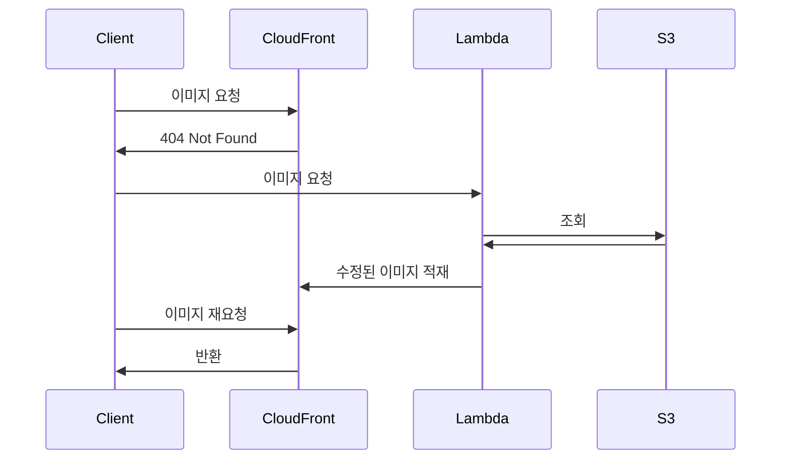
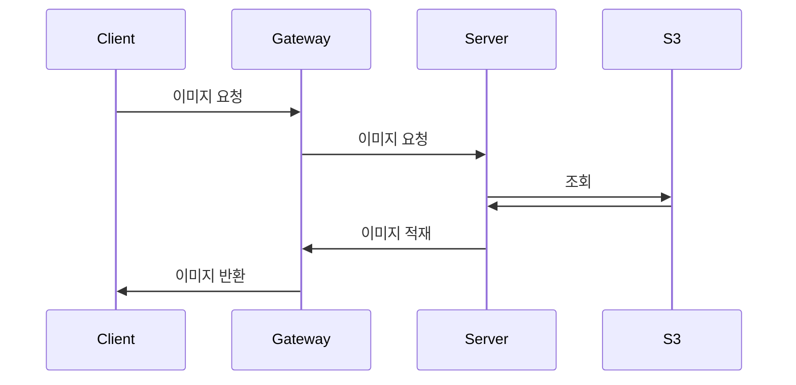

## Introduction

회사에는 이미지 리사이즈 기능이 필요했고 내가 도와주기로 했다.
요구사항 정제 과정에서 디자인 팀은 높은 이미지 퀄리티를 선호했고 프론트 팀은 빠른 이미지 전달 속도를 선호했고 절충안을 마련하기 위해 원활한 기능 변경이 필요했다.
그래서 빠르게 피드를 받을 수 있는 최소 기능만을 구현해야 했으며 이해관계자들 간 소통을 위해 빠른 개발을 추구했다.

<TOCInline toc={props.toc} exclude="Introduction" />

## 개발 전

### 계기

프론트엔드 팀은 이미지 관리 문제로 고충을 겪고 있었다.
마침 사이드 프로젝트로 여러 기술을 사용하고 싶었고, 관리 문제를 해결 할 수 있어보여서 도와주기로 했다.

프론트엔드 팀은 리사이즈 된 이미지, 압축된 이미지, 크롭한 이미지를 적재적소에 사용해야 하는데 많은 이미지를 어떻게 관리할지 고민하고 있었다.
저장-관리 비용을 생각했을 때 `webp`, `png` 등으로 관리하고 최소 2 개 이상의 사이즈를 사용한다면 비용이 대략 `N^3` 사이즈가 필요하다고 생각 할 수 있다.


조금 더 세밀하게 따져보면 한 달에 500개 정도의 이미지를 업데이트한다고 생각하고 이미지는 평균 3MB 라고 예상해보면 요청 1000회당 0.0045 USD 면 연간 0.027 USD 이라는 비용이 발생 한다.
리사이즈된 친구들을 모두 모은 크기가 원본 사이즈랑 동일하다고 생각해보면 6,000 * 6MB 이니 연간 36GB 데이터가 필요하지. 0.0024 * 36 = 0.0864 USD 가 필요하다.

즉, 한 달 동안 500개 원본에 대한 리사이징 본까지 저장한다면 연간 대략 0.1 USD 가 필요하다.

가장 무서운 건 저장소에는 데이터가 계속 쌓인다는 점인데, 특정한 이미지를 삭제하려면 관련된 이미지도 삭제해야 하는데 이런 부분을 관리하기가 되게 까다롭다.


그래서 관리 측면 비용을 해소에 집중했고 다음과 같은 기능을 제공했다.

- 이미지 관리 페이지
- 원본 이미지에 대한 리사이징 API

### 요구사항 정제와 빠른 개발

코드를 멋지게 짤지 고민하는 것도 재밌지만 주변에 도움이 되는 일이 보람차서 어떻게 하면 빠르게 문제를 해결할지 고민했다.

요구사항 정제 과정에서 알게 된 건 이해관계자들과의 협의였다.
디자인 팀은 높은 퀄리티를 선호했고 프론트 팀은 빠른 전달 속도를 선호했기 때문에 절충안을 마련하기 위해 테스트 할 수 있는 제품이 요구됐다.

###  리사이즈 기능은 어떻게 구현

다른 팀은 어떻게 이 문제를 해결 했을까라는 생각이 문득 스쳤다.
당근 마켓에서는 [람다를 활용한 이미지 리사이즈](https://medium.com/daangn/aws-lambda%EB%A5%BC-%EC%9D%B4%EC%9A%A9%ED%95%9C-%EC%9D%B4%EB%AF%B8%EC%A7%80-%EC%8D%B8%EB%84%A4%EC%9D%BC-%EC%83%9D%EC%84%B1-%EA%B0%9C%EB%B0%9C-%ED%9B%84%EA%B8%B0-acc278d49980)를 통해 이미지 저장 비용과 관리 비용을 줄였다.

람다를 활용하면 서버 관리 비용을 줄이는 데 획기적이겠지만 사용성과 관리 측면에 집중하고 싶었던터라 직접 서버를 배포하도록 구현했다.

기존 람다를 활용 한다면 클라이언트에서 조회 흐름은 다음과 같다.



`client`는 `server`에게 리사이즈 요청을 하고 `cdn`에 저장할 때까지 기다린다음 재요청 흐름이 완벽해보이지 않았다.
만약 `cdn에 저장하는데 실패하게 된다면?`, `저장하기전에 재요청을 보낸다면?`과 같은 `failover`도 생각해야 하는 문제도 있었다.

그럴바에 직접 서버를 구축한다면 사용성 측면과 가용성 측면을 높에 유지 할 수 있어보였고 실행에 옮겼다.



결국 스프링 클라우드 게이트웨이가 4.x 버전으로 올라오면서 캐시 레이어를 추가한 걸 활용해 리사이즈 서비스와 스프링 클라우드 게이트를 활용한 `CDN`을 구축하게 됐다.

## 개발

### 코틀린을 활용한 깔끔한 디자인 패턴

이미지를 리사이징하거나 크롭하거나 압축하는 과정이 마치 원본에 데코를 추가하는 느낌이라 데코레이터 패턴을 활용할 수 있어보였다.

> 책임 사슬 패턴도 고려했는데 책임 사슬 패턴은 책임을 처리할 수 있는 객체를 찾을 때까지 객체를 순회하는 방식이라 적합하지 않았다.

마침 최근 한 달 간 코틀린을 배우면서 알게 된 `by` 키워드로 데코레이터를 쉽게 구현 할 수 있었다.

```kotlin
abstract class ThumbnailDecorator(
    private val thumbnail: Thumbnail
) : Thumbnail by thumbnail {
    override suspend fun content(): ByteArray {
        ...
    }
}
```

덕분에 기능 추가가 쉬웠고 SRP 를 지킨 덕분에 관리도 쉬워졌으며 추가된 기능은 다음과 같다.


데코레이터 패턴이 깨지지 않도록 재정의한 코드를 호출 할 수 있도록 custom getter 를 추가하는 등의 작업을 이어나갔다.
오버라이드 할 때 필드를 어떻게 호출하느냐에 따라 체이닝된 메서드 호출 유무가 결정되니 꽤나 크리티컬 한 문제가 발생할 수 있었다.

### 클라우드 게이트웨이를 활용한 CDN 구축

클라우드 게이트웨이를 활용해 `CDN`을 구축하기 위해서는 `ResponseCacheManager` 에 대한 이해가 필요했다.
`ResponseCacheManager#filter` 메서드 동작은 다음과 같다.

1. `GET` 요청이 있는지 확인한다.
2. 키를 활용해 캐시가 존재하는지 확인한다.
3. 캐시가 있을 때
    1. 동일한 요청 헤더 `Cache-control` 이 `no-cache`인 경우 `304`를 반환한다.
    2. 캐시가 있을 때 동일한 요청 헤더 `Cache-control` 이 `no-cache` 가 아닌 경우 게이트웨이에 저장된 응답 데이터를 반환한다.
    3. 캐시가 있을 때 동일한 요청 헤더 `Cache-control` 이 `no-stored`인 경우 원본을 가져온다.
4. 캐시가 없는 경우
    1. 캐싱 할 수 있는지 확인한다.
    2. 데이터를 캐싱한다.

어떤 값으로 캐시 데이터를 찾는지는 `URI`, `Header`로 요청을 비교하게 된다.

```java
public class CacheKeyGenerator {

	private final ThreadLocal<MessageDigest> messageDigest;

	/* for testing */ static final List<KeyValueGenerator> DEFAULT_KEY_VALUE_GENERATORS = List.of(
			new UriKeyValueGenerator(), new HeaderKeyValueGenerator(HttpHeaders.AUTHORIZATION, KEY_SEPARATOR),
			new CookiesKeyValueGenerator(KEY_SEPARATOR));
    //...
}
```

저장되는 키를 캡쳐 해봤을 때 다음과 같다.


## 마지막으로

### 코드 없이 정책을 해결하는게 베스트라는 의미를 느꼈다.

완성하고 나니 이미지 라사이징 프로젝트는 가용하려는 리소스 양이 적고 트래픽이 많지 않다면 비효율적임을 체감했다.
이미비교 대상에서 비용 차이가 크지 않다는 것을 알 수 있는데, 그걸 POC 과정이 끝나고나서 알게됐다.
만약 코드 없이 알 수 있었다면 다른 기능 개발에 더욱 신경 썼지 않았을까 생각든다.

덕분에 요구사항을 이해하고 한 번 더 고민하는 습관을 가지게 됐으며 코드 없이 정책을 해결하는게 베스트라는 의미를 느꼈다.

### 효율적인 개발이 무엇일까

이전 프로젝트에서 비효율적으로 업무를 진행한게 너무 아쉬워서 이번엔 최대한 효율적으로 진행해보려고 신경썼다.
그 중 최소 기능을 개발해서 이해관계자들 간 원활한 소통이 가능하게 하며 빠른 의사 결정에 기여했다.

### 기술 트렌드 따라가는 일 재밌네...

요즘 새로운 기술들을 읽으면서 기술은 환경에 맞게 진화함을 깨달았다.
그래서 민감하게 트렌드에 따라가 효율적인 개발을 할 수 있도록 지향할 수 있도록 사용하려는 라이브러리의 추가되는 기술을 적극적으로 활용했다.

### POC 과정에서 미완성 된 프로젝트 공유

> 작업 완료율이 100% 마다 공유하는 신입 개발자와 80% 마다 공유하는 신입 개발자 중 어떤 개발자를 선호하게 될까?

빠르게 피드백을 받아 합당한지 파악하는 게 가장 중요하다고 생가해서 70% 완성도로 빠른 의사결정이 가능하도록 신경썼다.
