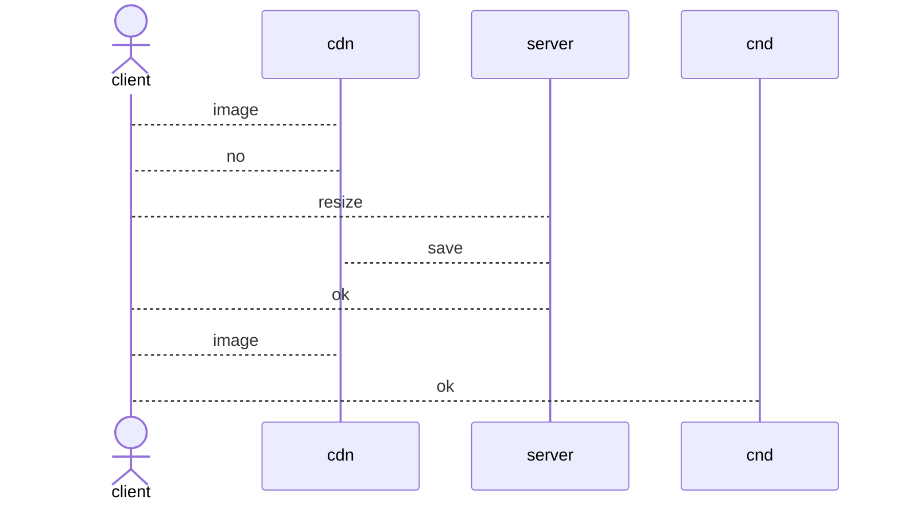

## Introduction

회사에 필요한 이미지 리사이즈 기능이 필요했고 내가 도와주기로 했어.

요구사항 정제 과정에서 디자인 팀은 높은 이미지 퀄리티를 선호했고 프론트 팀은 빠른 이미지 전달 속도를 선호했어.
절충안을 마련하기 위해 원활한 기능 변경이 필요했지.

그래서 빠르게 피드를 받을 수 있는 최소 기능만을 구현해야 했어.
테스트 코드, 검증 빼고 이해관계자들 간 소통을 위해 빠른 개발을 추구했어.

이런 과정이 어떻게 이뤄졌는지 하나씩 살펴볼게.

<TOCInline toc={props.toc} exclude="Introduction" />

## 리사이즈된 이미지 전달 서비스

### 계기

프론트엔드 팀은 이미지 관리 문제로 고충을 겪고 있더라구.
마침 사이드 프로젝트로 여러 기술을 사용하고 싶었고, 관리 문제를 해결 할 수 있어보여서 도와주기로 했어!

프론트엔드 팀은 리사이즈 된 이미지, 압축된 이미지, 크롭한 이미지를 적재적소에 사용해야 하는데 많은 이미지를 어떻게 관리할지 고민하고 있었어.
저장-관리 비용을 생각했을 때 `webp`, `png` 등으로 관리하고 최소 2 개 이상의 사이즈를 사용한다면 비용이 대략 `N^3` 사이즈가 필요하다고 생각 할 수 있지.


조금 더 세밀하게 따져볼까?
대략 한 달에 500개 정도의 이미지를 업데이트한다고 생각하고.
이미지는 평균 3MB 라고 생각해보자.

요청 1000회당 0.0045 USD 면 연간 0.027 USD 이라는 비용이 발생 해.


리사이즈된 친구들은 보통 압축되어 작은 사이즈로 만들어져.
리사이즈된 친구들을 모두 모은 크기가 원본 사이즈랑 동일하다고 생각해볼게.
그럼 6,000 * 6MB 이니 연간 36GB 데이터가 필요하지. 0.0024 * 36 = 0.0864 USD 가 필요해.


계산해보면 연간 대략 0.1 USD 가 필요해. 생각보다 사이즈가 안되니 비용 측면에서는 전혀 신경쓸 일이 없어.

가장 무서운 건 저장소에는 데이터가 계속 쌓인다는 점이야.
특정한 이미지를 삭제하려면 관련된 이미지도 삭제해야 하는데 이런 부분을 관리하기가 되게 까다로워.


### 프론트 입장에서 생각해보자.

업무를 하면서 코드 없이 문제를 해결하는게 가장 베스트라는 걸 몸소 깨달았지.
어떻게 하면 코드를 멋지게 짤지 고민하는 것도 재밌지만 성과가 나오는게 재밌더라구. (내가 생각하는 성과는 누군가에게 도움이 **된** 일이라고 생각해.)
그래서 어떻게 하면 빠르게 문제를 해결할지 고민을 많이 하고 있어.

이번에는 나의 생각을 관철 해보려고 프론트엔드 팀 분들에게 이것저것 물어봤어.
특히나 만들면 바로 사용할 수 있는지를 물어봤어.
열심히 노력한게 사용 안되면 슬플 것 겉거든... 흑흑

그래서 알게 된 건 이해관계자들과의 협의가 필요하다는 점이었어.
특히나 디자인 팀은 높은 퀄리티를 선호했고 프론트 팀은 빠른 전달 속도를 선호했어.
절충안을 마련하기 위해 원활한 기능 변경이 필요했지.

그래서 원활한 소통이 될 수 있도록 샘플을 만들면 좋겠다고 생각했고 빠른 개발이 중요하게 됐어.
결국 테스트 코드 없는 기능이 일주일 만에 탄생하게 됐어. ㅋㅋㅋ

### 계획 1 - 리사이즈 기능은 어떻게 구현하지?

다른 팀은 어떻게 이 문제를 해결 했을까라는 생각이 문득 스쳤어.
당근 마켓에서는 [람다를 활용한 이미지 리사이즈](https://medium.com/daangn/aws-lambda%EB%A5%BC-%EC%9D%B4%EC%9A%A9%ED%95%9C-%EC%9D%B4%EB%AF%B8%EC%A7%80-%EC%8D%B8%EB%84%A4%EC%9D%BC-%EC%83%9D%EC%84%B1-%EA%B0%9C%EB%B0%9C-%ED%9B%84%EA%B8%B0-acc278d49980)를 통해 이미지 저장 비용과 관리 비용을 줄였어.

람다를 활용하면 서버 관리 비용을 줄이는 데 획기적이겠더라구!!
하지만 기능 추가에는 꽤나 많은 공을 들일 듯 했어.
코드들이 기능 추가에 유연하지 않았고 테스트 코드가 없는게 문제였지.

이미지 추가, 삭제, 리스트 조회 등의 UI 도 필요해보였어.
그래서 서버 관리 비용을 들이더라도 기능 추가가 쉬운게 베스트라고 생각했어.

### 계획 2 - s3 접근 비용은 캐시 레이어로 해결 할 수 있어보여.

당근 마켓은 [`on-the-fly` 전달 방식](https://medium.com/daangn/lambda-edge%EB%A1%9C-%EA%B5%AC%ED%98%84%ED%95%98%EB%8A%94-on-the-fly-%EC%9D%B4%EB%AF%B8%EC%A7%80-%EB%A6%AC%EC%82%AC%EC%9D%B4%EC%A7%95-f4e5052d49f3)을 활용해 s3 접근 비용도 줄여나갔지.
좋은 방법이었어!

하지만 `cdn`을 사용하면 외부에 의존적인 문제와 비용이 든다는 문제가 있었지.
또한 `cdn`에 없으면 `client`는 `server`에게 리사이즈 요청을 하고 `cdn`에 저장할 때까지 기다린다음 재 요청해야 했어.
그런 흐름이 프론트 팀의 개발을 복잡하게 만들 수 있어보였어.



그래서 직접 구현하기로 했어.
`nginx`가 정적 리소스 캐싱과 관련된 내용이 많았지만 `nginx`에 대해서 몰라서 러닝 커브가 컸어.
그래서 최근에 학습한 스프링 클라우드 게이트웨이를 활용해보려해!

스프링 클라우드 게이트웨이가 4.x 버전으로 올라오면서 캐시 레이어를 추가했거든!!
요즘 개발 트렌드가 어떻게 흘러가는지 확인하려고 최신 버전들을 읽고 있는데 도움이 됐어.

그래서 리사이즈 서비스와 스프링 클라우드 게이트를 활용한 `CDN`을 구축해봤어.

### 코루틴을 활용한 서버 구축

최근 코투린과 코틀린을 학습하기도 했고 마침 aws-sdk-kotlin 이 코루틴 기반으로 설계가 됐어.
그래서 프로젝트에 적용하기로 했지.
덕분에 코드 간결함을 배로 늘릴 수 있었어.

**AS-IS**

```java
@GetMapping("/pre-signed")
Mono<ResponseEntity<String>> getPreSignedUrl(@RequestParam String filename) {
    return ResponseEntity.ok()
        .cacheControl(CacheControl.noStore())
        .body(s3Service.getPreSigned(filename))
}
```

**TO-BE**

```kotlin
@GetMapping("/pre-signed")
suspend fun getPreSignedUrl(@RequestParam filename: String): ResponseEntity<String> {
    return ResponseEntity.ok()
        .cacheControl(CacheControl.noStore())
        .body(s3Service.getPreSigned(filename))
}
```

비동기 프로세스를 구현하면서 느낀건 `활용 할 수 있는 리소스를 최대한 활용하자`의 의미를 이해 할 수 있었어.
기존 MVC 패턴에서는 가용 할 수 있는 스레드 풀에 제한을 둬 `문제가 발생하지 않도록 리소스를 제한하자`였었는데, 리소스를 바라보는 프로그래밍 환경이 달라졌다는 것을 캐치했지.
음 개인적인 견해로는 현재 컴퓨팅 파워를 다 쓸만큼 프로그래밍이 성숙하지 않았다로 볼 수 있어보여.

그래서 최대한 프로그래밍 리소스를 활용 할 수 있도록 논블로킹 비동기 프로세스를 채택했어.

### 코틀린을 활용한 깔끔한 디자인 패턴

최근 한 달 간 코틀린을 배우면서 by 키워드를 알게 됐는데, 데코레이터 패턴에 활용 할 수 있겠구나 라는 생각을 했어.
그래서 다음처럼 데코레이터를 쉽게 구현 할 수 있었지.

```kotlin
abstract class ThumbnailDecorator(
    private val thumbnail: Thumbnail
) : Thumbnail by thumbnail {
    override suspend fun content(): ByteArray {
        ...
    }
}
```

덕분에 기능 추가가 쉬웠고 SRP 를 지킨 덕분에 관리도 쉬워졌지. 추가된 기능은 다음과 같아.


아쉬운건 데코레이터 패턴이 깨지기 쉽다는 거야.
오버라이드 할 때 필드를 어떻게 호출하느냐에 따라 체이닝된 메서드 호출 유무가 결정되니 꽤나 크리티컬 한 문제가 발생할 수 있었어.

이런 부분은 신경쓸게 많았어.
어떻게하면 잘 안깨질지 고민 해보고는 있는데 아직까지는 기발한 아이디어는 없어.

### 클라우드 게이트웨이를 활용한 CDN 구축

클라우드 게이트웨이를 활용해 `CDN`을 구축하기 위해서는 `ResponseCacheManager` 에 대한 이해가 필요했어.
`ResponseCacheManager#filter` 메서드 동작은 다음과 같아.

1. `GET` 요청이 있는지 확인한다.
2. 키를 활용해 캐시가 존재하는지 확인한다.
3. 캐시가 있을 때
    1. 동일한 요청 헤더 `Cache-control` 이 `no-cache`인 경우 `304`를 반환한다.
    2. 캐시가 있을 때 동일한 요청 헤더 `Cache-control` 이 `no-cache` 가 아닌 경우 게이트웨이에 저장된 응답 데이터를 반환한다.
    3. 캐시가 있을 때 동일한 요청 헤더 `Cache-control` 이 `no-stored`인 경우 원본을 가져온다.
4. 캐시가 없는 경우
    1. 캐싱 할 수 있는지 확인한다.
    2. 데이터를 캐싱한다.

어떤 값으로 캐시 데이터를 찾는지 궁금할거야 그래서 찾아봤어.
키를 저장 할 때 URI, 인증 정보, 쿠키 정보들로 비교하게 돼.

```java
public class CacheKeyGenerator {

	private final ThreadLocal<MessageDigest> messageDigest;

	/* for testing */ static final List<KeyValueGenerator> DEFAULT_KEY_VALUE_GENERATORS = List.of(
			new UriKeyValueGenerator(), new HeaderKeyValueGenerator(HttpHeaders.AUTHORIZATION, KEY_SEPARATOR),
			new CookiesKeyValueGenerator(KEY_SEPARATOR));
    //...
}
```

저장되는 키를 캡쳐 해봤어.


## 마지막으로

### 효율적인 개발이 무엇일까

이전 프로젝트에서 꽤나 비효율적으로 업무를 진행한 부분이 있었는데 너무 아쉬웠거든.
그래서 이번 프로젝트에서는 최대한 효율적으로 진행해보려고 노력했어.

최소 기능을 개발해서 이해관계자들 간 원활한 소통이 가능하게 하며 오버엔지니어링을 방지했지.

어떨때 테스트 코드를 짜야할지 이런 부분들을 고민 할 수 있어서 굉장히 뜻깊은 시간이었어.

### 기술 트렌드 따라가는 일 재밌네...

요즘 새로운 기술들을 읽으면서 도입하고 있어.
내가 필요한 기능들은 이미 있거나 이제 막 도입되고 있어서 매우 신기했어.
결국 상황에 맞게 기술이 진화함을 알 수 있었고 앞으로도 민감하게 트렌드에 따라가 효율적인 개발을 할 수 있도록 지향해야겠어.

### 비용이 싸진게 맞나...?

비용 부문은 솔직히 잘 모르겠어.
오히려 더 비싸진게 아닌가 걱정되는 부분도 있거든.

그럼에도 이런 선택을 하게 된 계기는 이미지 관리가 정말 쉬워질 수 있어서 였어.
한 UI에서 이미지 저장, 삭제, 수정이 가능하고 관련 API 설명이 작성되어 있다면 사용자 입장에서는 얼마나 편리할까.
그런 이점들까지 따지면 비슷하지 않을까 생각해.

사람들은 직관을 믿어라고 하지만 내 직관은 믿으면 안될 것 같아. ㅋㅋ
난 내가 하고싶은 걸 하려는게 직관인데 그 결정에는 비용 계산이 수반되지 않는 경우가 있거든.
직관을 믿기 전에 주변 사람들에게 피드백을 받도록 신경 써야겠어.
