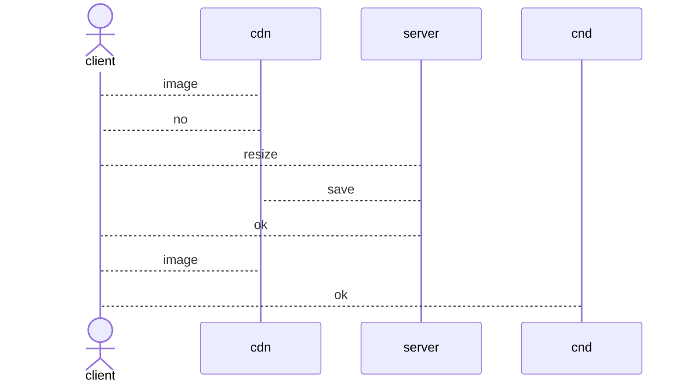

## Introduction

<TOCInline toc={props.toc} exclude="Introduction" />

## 리사이즈된 이미지 전달 서비스

### 계기

프론트엔드 팀은 이미지 관리 문제로 고충을 겪고 있더라구.
마침 사이드 프로젝트로 여러 기술을 사용하고 싶었고, 관리 문제를 해결 할 수 있어보여서 도와주기로 했어!

프론트엔드 팀은 리사이즈 된 이미지, 압축된 이미지, 크롭한 이미지를 적재적소에 사용해야 하는데 많은 이미지를 어떻게 관리할지 고민하고 있었어.
가장 무서운 건 저장소에는 데이터가 계속 쌓인다는 점이야.
특정한 이미지를 삭제하려면 관련된 이미지도 삭제해야 하는데 이런 부분을 관리하기가 되게 까다로워.

### 프론트 입장에서 생각해보자.

업무를 하면서 코드 없이 문제를 해결하는게 가장 베스트라는 걸 몸소 깨달았지.
어떻게 하면 코드를 멋지게 짤지 고민하는 것도 재밌지만 성과가 나오는게 재밌더라구. (내가 생각하는 성과는 누군가에게 도움이 **된** 일이라고 생각해.)
그래서 어떻게 하면 빠르게 문제를 해결할지 고민을 많이 하고 있어.

이번에는 나의 생각을 관철 해보려고 프론트엔드 팀 분들에게 이것저것 물어봤어.
특히나 만들면 바로 사용할 수 있는지를 물어봤어.
열심히 노력한게 사용 안되면 슬플 것 겉거든... 흑흑

그래서 알게 된 건 이해관계자들과의 협의가 필요하다는 점이었어.
그래서 원활한 소통이 될 수 있도록 샘플을 만들면 좋겠다고 생각했고 빠른 개발이 중요하게 됐어.

그래서 테스트 코드 없는 기능이 일주일 만에 탄생하게 됐어. ㅋㅋㅋ

### 계획 1 - 리사이즈 기능은 어떻게 구현하지?

다른 팀은 어떻게 이 문제를 해결 했을까라는 생각이 문득 스쳤어.
당근 마켓에서는 [람다를 활용한 이미지 리사이즈](https://medium.com/daangn/aws-lambda%EB%A5%BC-%EC%9D%B4%EC%9A%A9%ED%95%9C-%EC%9D%B4%EB%AF%B8%EC%A7%80-%EC%8D%B8%EB%84%A4%EC%9D%BC-%EC%83%9D%EC%84%B1-%EA%B0%9C%EB%B0%9C-%ED%9B%84%EA%B8%B0-acc278d49980)를 통해 이미지 저장 비용과 관리 비용을 줄였어.

람다를 활용하면 서버 관리 비용을 줄이는 데 획기적이겠더라구!!
하지만 기능 추가에는 꽤나 많은 공을 들일 듯 했어.
코드들이 기능 추가에 유연하지 않았고 테스트 코드가 없는게 문제였지.

이미지 추가, 삭제, 리스트 조회 등의 UI 도 필요해보였어.
그래서 서버 관리 비용을 들이더라도 기능 추가가 쉬운게 베스트라고 생각했어.

### 계획 2 - s3 접근 비용은 캐시 레이어로 해결 할 수 있어보여.

당근 마켓은 [`on-the-fly` 전달 방식](https://medium.com/daangn/lambda-edge%EB%A1%9C-%EA%B5%AC%ED%98%84%ED%95%98%EB%8A%94-on-the-fly-%EC%9D%B4%EB%AF%B8%EC%A7%80-%EB%A6%AC%EC%82%AC%EC%9D%B4%EC%A7%95-f4e5052d49f3)을 활용해 s3 접근 비용도 줄여나갔지.
좋은 방법이었어!

하지만 `cdn`을 사용하면 외부에 의존적인 문제와 비용이 든다는 문제가 있었지.
또한 `cdn`에 없으면 `client`는 `server`에게 리사이즈 요청을 하고 `cdn`에 저장할 때까지 기다린다음 재 요청해야 했어.
그런 흐름이 프론트 팀의 개발을 복잡하게 만들 수 있어보였어.

그래서 직접 구현하기로 했어.
`nginx`가 정적 리소스 캐싱과 관련된 내용이 많았지만 `nginx`에 대해서 몰라서 러닝 커브가 컸어.
그래서 최근에 학습한 스프링 클라우드 게이트웨이를 활용해보려해!

스프링 클라우드 게이트웨이가 4.x 버전으로 올라오면서 캐시 레이어를 추가했거든!!
요즘 개발 트렌드가 어떻게 흘러가는지 확인하려고 최신 버전들을 읽고 있는데 도움이 됐어.

그래서 리사이즈 서비스와 스프링 클라우드 게이트를 활용한 `CDN`을 구축해봤어.

### 마지막으로

한 주간 변환된 이미지를 전달하고 관리하는 서비스를 만들면서 `어떻게하면 효율적으로 일 할 수 있을까?`혹은 `어떻게 하면 내가 한 일이 빛을 발휘할까?`를 고민했어.
그런 이야기를 [글](https://tis-blog.vercel.app/blog/project/fly-away-resized-image)로 정리해봤어.
