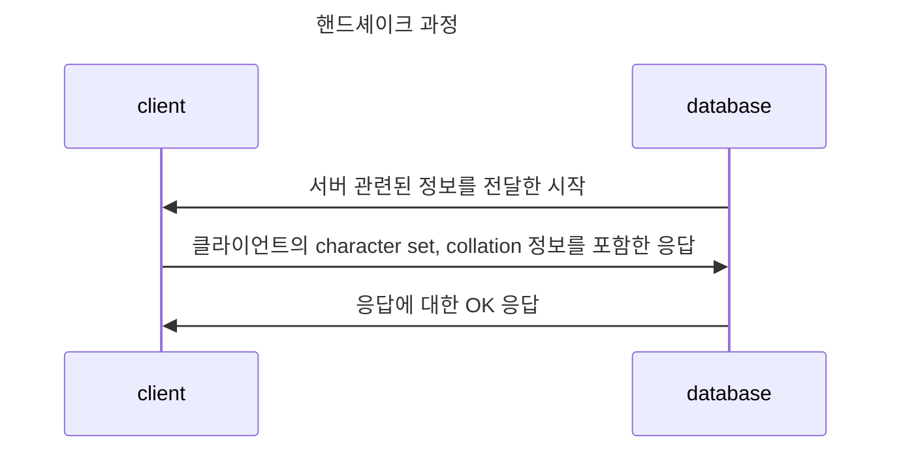

## Introduction

<TOCInline toc={props.toc} exclude="Introduction" />

## 문제

### 이슈 내용

마이그레이션 작업 배포 과정에서 다음과 같은 문제가 발생했고, 롤백이 진행됐다.

```sql
Illegal mix of collations (utf8mb4_unicode_ci,IMPLICIT)
and (utf8mb4_general_ci,IMPLICIT) for operation '='
```

코드 수정이 없던 상황이라 문제 파악이 어려웠다.

### 이슈 분석

문제 상황을 간단하게 재현했다.

```sql
CREATE TABLE t2
(
    a VARCHAR(10) CHARACTER SET utf8mb4 collate utf8mb4_unicode_ci,
    b VARCHAR(10) CHARACTER SET utf8mb4 collate utf8mb4_general_ci
);

INSERT INTO t2 VALUES ('a', 'b');
show full columns from aplus_support.t2;

SELECT CONCAT(a, b)
FROM t2
where a = b;
```

발생하는 문제를 확인 했을 때 유사한 문제로 확인할 수 있었다.

```sql
[HY000][1267] (conn=230295) Illegal mix of collations (utf8mb4_unicode_ci,IMPLICIT)
 and (utf8mb4_general_ci,IMPLICIT) for operation '='
```

즉, `column`에  설정된 `collation`은 `utf8mb4_general_ci`이고, `connection`에 설정된 `collation`은 `utf8mb4_unicode_ci`이어서 비교할 수 있는 상황이었다.

**하지만** 실제 설정된 `collation` 변수를 확인 했을 때 `utf8mb4_unicode_ci` 와 연관된 설정 값은 없었다. 설정된 변수는 다음과 같았다.

- `connection collation`은 `utf8mb3_genenral_ci`
- `database collation`은 `utf8mb4_general_ci`
- `server collation`은 `latin1_swedish_ci`

문제 원인을 분석하자면 두 가지다.

- 비교 할 수 없어서 결과를 받아 올 수 없었다.
- 설정된 값과 다른 `utf8mb4_unicode_ci` 값으로 `**connection collation**`이 설정되어 있다.

## 원인

### 1. 왜 설정 값과 다른 값으로 변경됐는지

우선 `utf8mb4_unicode_ci` 값이 어떻게 전달되게 되는지 확인해보기로 했다. 데이터베이스 설정 값은 변경되지 않았지만, 마이그레이션 이후 발생하게 됐다. 그래서 mariadb client 를 먼저 확인했다.

그럼 collation 설정 값을 변경하는 시점이 존재하게 됨을 추측해볼 수 있다. mariadb의 커넥션을 얻기 위해 핸드셰이크 과정을 거치는 모습을 먼저 확인했다. 핸드셰이크 과정에서 client의 character set과 collation을 전달하면 mariadb는 client에 맞는 커넥션 설정을 진행하게 된다. (해당 [링크](https://mariadb.com/kb/en/connection/#initial-handshake-packet)에서 확인 가능하다.)



변경된 원인은 `decideLanguage` 로 인한 `collation` 설정이 변경되는 문제였다.

```java
public static byte decideLanguage(InitialHandshakePacket handshake) {
    short serverLanguage = handshake.getDefaultCollation();
    // return current server utf8mb4 collation
    return (byte)
        ((serverLanguage == 45 // utf8mb4_general_ci
                || serverLanguage == 46 // utf8mb4_bin
                || (serverLanguage >= 224 && serverLanguage <= 247))
            ? serverLanguage
            : 224); // UTF8MB4_UNICODE_CI;
  }
```

즉, `server character set`이 `latin1`(code 값이 5)로 설정되어 있어서 **connection collation**이 `utf8mb4_unicode_ci`로 설정되어 버린다.

### 2. 왜 비교할 수 없는지

원하는 값이 출력되지 않을 수 있기 때문이다. 값을 비교할 때 정렬 방법으로 동일한 문자인지를 확인하게 된다. 각 다른 character set 과 collate를 설정한 다음 동일한 데이터를 추가해보겠다.

```sql
CREATE TABLE german1(c CHAR(10)) CHARACTER SET latin1 COLLATE latin1_german1_ci;
CREATE TABLE german2(c CHAR(10)) CHARACTER SET latin1 COLLATE latin1_german2_ci;
CREATE TABLE germanutf8(c CHAR(10)) CHARACTER SET utf8mb4 COLLATE utf8mb4_unicode_ci;
INSERT INTO german1 VALUES ('Bar'), ('Bär');
INSERT INTO german2 VALUES ('Bar'), ('Bär');
INSERT INTO germanutf8 VALUES ('Bar'), ('Bär');
```

그럼 비교돼서 조회되는 데이터는 다음처럼 모두 다르다. `a`와 `ä` 를 동일한 문자로 인식할지 여부처럼 언어의 규칙에 따라 어떻게 비교할지는 정렬 방법에 다라 결정된다.

```sql
SELECT * FROM german1 WHERE c = 'Bär';

--- return ---

+------+
| c    |
+------+
| Bar  |
| Bär  |
+------+

SELECT * FROM german2 WHERE c = 'Bär';

--- return ---

+------+
| c    |
+------+
| Bär  |
+------+

SELECT * FROM germanutf8 WHERE c = 'Bär';

--- return ---

+------+
| c    |
+------+
| Bar  |
| Bär  |
+------+
```

그럼 `collation이 다르면 항상 에러가 발생하는가?`라고 하면 그건 또 아니다. mysql은 쿼리를 실행할 때 딱 하나의 collation만 사용하기 위해 결정하는 과정을 거친다. 이 때 어떤 collation을 사용할지 결정하기 위해 호환성을 파악하게 된다.

> 어떤 순서로 결정을 하는지는 해당 [링크](https://dev.mysql.com/doc/refman/8.0/en/charset-collation-coercibility.html)에서 확인 할 수 있다.

**우선 둘 다 유니코드이지만 collation이 다른 경우 오류가 발생하고,  둘 다 유니코드가 아닌 경우도 오류가 발생한다.**

오류가 아닌 경우는 한쪽에 유니코드가 있을 때이다. 다른 한쪽의 character set을 유니코드로 변경한 다음 연산하기 시작한다. 아래 예시인 경우 `latin` 언어를 `utf8mb4`로 변경해서 `utf8mb4` 컬럼에 설정된 정렬 설정으로 결과가 반환되게 된다.

```sql
SELECT CONCAT(utf8mb4_column, latin1_column) FROM t1;
```

현재같은 케이스는 동일한 유니코드이지만 collation이 달라 발생하게 된다. `XXX_unicode_ci` 와 `XXX_general_ci` 문제가 아니라 동일한 유니코드에서 collation이 달라지게 되어서 발생하게 되는 문제인 것이다. `utf8mb4_swedish_ci`와 `utf8mb4_general_ci`를 비교하는 경우도 문제가 발생한다.

```sql
[HY000][1267] (conn=5) Illegal mix of collations
(utf8mb4_swedish_ci,IMPLICIT) and (utf8mb4_general_ci,IMPLICIT)
for operation '='
```

## 결론

문제가 발생하게 된 계기는 mariadb client가 connection의 collation을 강제 변경한 게 원인이었고, mysql/mariadb는 column과 connection의 character set은 같지만 collation이 달라 오류를 던졌다.

해결책은 다음 정도가 생각나는데, database의 server collation 설정을 변경할 계획이다. 첫 번째 방법으로 임시적으로 해결 할 수 있지만 server collation 을 우리가 원하는 xxx_general_ci 로 default_collation으로 지정해야 고민한 괴리감이 없어지리라 생각한다.

- connection collation 설정 값 지정
- database의 server collation 설정
- mariadb client 버전 변경

그 밖에 collation으로 소소한 성능 상승 효과를 누릴 수 있어보여서 collation 과 관련된 이야기를 추가로 해보려 한다.